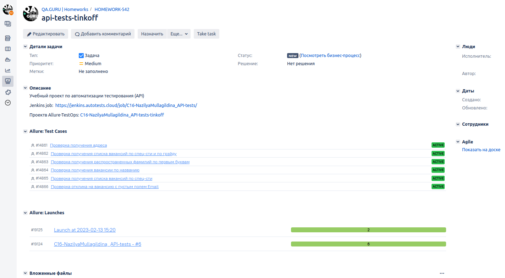
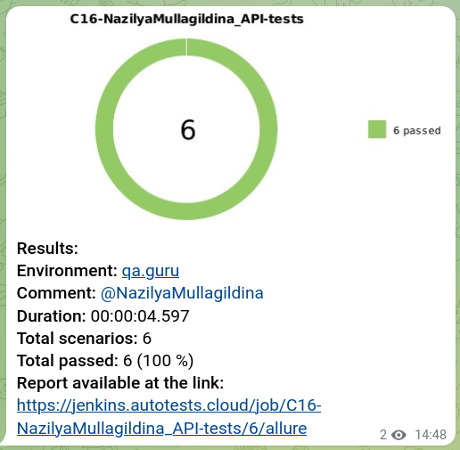

## Учебный проект по автоматизации тестирования (API)
### Веб сайт <a target="_blank" href="https://www.tinkoff.ru/career/it/about/">Работа в Тинькофф</a>

## :maple_leaf: Содержание:

- Технологии и инструменты
- Список проверок, реализованных в тестах
- Запуск тестов (сборка в Jenkins)
- Allure-отчет
- Интеграция с Allure TestOps
- Интеграция с Atlassian Jira
- Уведомление в Telegram о результатах прогона тестов

## :maple_leaf:Технологии и инструменты

## :maple_leaf: Список проверок, реализованных в автотестах

- [x] Проверка получения вакансии по названию
- [x] Проверка отклика на вакансию
- [x] Проверка получения списка вакансий по спец-сти / по грэйду

## :maple_leaf: Запуск тестов

###  Локальный запуск :
1. Запуск с командной строки: gradle clean test
2. Получение отчёта: gradle allureServe

###  Удаленный запуск (в Jenkins):
1. Открыть <a target="_blank" href="https://jenkins.autotests.cloud/job/C16-NazilyaMullagildina_API-tests/">проект</a>

2. Выбрать пункт **Собрать с параметрами**
3. Нажать **Собрать**
4. Результат запуска сборки можно посмотреть в отчёте Allure

## </a> Отчет в <a target="_blank" href="https://jenkins.autotests.cloud/job/C16-NazilyaMullagildina_API-tests/3/allure/">Allure report</a>

###  Главное окно

###  Тесты

###  Графики

## </a> Интеграция с <a target="_blank" href="https://allure.autotests.cloud/project/1865/dashboards/2126">Allure TestOps</a>
### Cписок всех тест кейсов

### Dashboard с результатами тестирования

### Пример отчёта выполнения одного из автотестов

### Настроен запуск из Allure TestOps выборочных тест-кейсов

### Формируется Launch, происходит автоматический запуск в Jenkins только отмеченных тест-кейсов

## </a> Интеграция с <a target="_blank" href="https://jira.autotests.cloud/browse/HOMEWORK-542">Atlassian Jira</a>

## </a> Уведомление в Telegram о результатах прогона тестов

[Вернуться к оглавлению ⬆](#Содержание)
